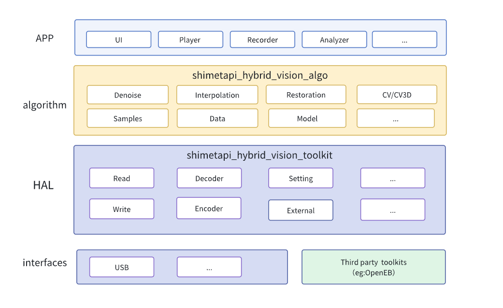
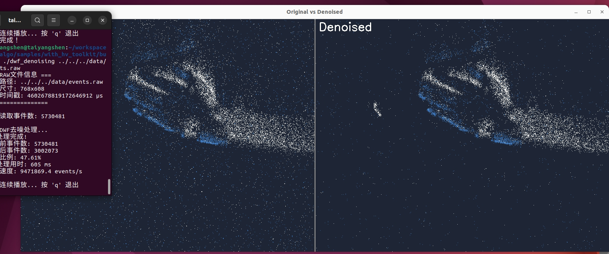

# Hybrid Vision Algo(HVAlgo) - 高性能事件视觉算法库

**中文** | [English](README_EN.md)

## 简介

HVAlgo 是ShiMetaPi 专为事件相机（Event Camera）设计的高性能算法库，提供了多种先进的事件去噪、计算机视觉和图像恢复算法。该库基于ShiMetaPi Hybird Vision SDK 构建，支持实时事件流处理，适用于机器人视觉、自动驾驶、高速运动分析等应用场景。

ShiMetaPi Hybrid Vision SDK 由 hybrid_vision_toolkit 和 hybrid_vision_algo 两个独立的SDK组成，分别实现视觉融合相机的接口控制和算法处理。

## 项目框图



## **`shimetapi_Hybrid_vision_algo (算法层 SDK)`**

- **定位：** 这是 SDK 的核心算法处理层，位于架构的中间层（黄色部分）。
- **核心功能：** 专注于处理来自事件相机的原始数据流，执行高级的计算机视觉算法，以提升数据质量、提取有用信息或进行三维理解。
- **包含的模块：**
  - **降噪 (`Denoise`):** 去除事件流中的噪声，提高信号质量。
  - **插值 (`Interpolation`):** 用于在事件之间生成中间数据点，或与标准帧图像进行时空对齐/融合。
  - **修复 (`Restoration`):** 用于处理数据缺失或异常。
  - **计算机视觉/三维视觉 (`CV/CV3D`):** 包含实现事件相机特定或融合应用的算法，如目标检测、跟踪、三维重建、姿态估计等。
  - **样本与数据 (`Samples/data`):** 提供示例代码、模型或必要的数据集。
  - **外部依赖 (`external`):** 通过集成第三方库给用户提供更多设备的选择,例如：shimetapi Hybrid vision toolkit`，OpenEb(通过命令安装)等 。
- **作用：** 它为上层应用 (`APP`) 提供了经过处理、增强或理解的事件数据信息。应用开发者主要调用这一层的接口来实现事件相机的高级功能（如播放、录制、分析）。

## **`shimetapi_Hybrid_vision_toolkit (HAL层工具包)`**

- **定位：** 这是 SDK 的 硬件抽象层 (HAL) 和基础工具层 ，位于算法层之下（深蓝色部分）。
- **核心功能：** 提供与硬件交互和数据流基础操作的功能。它负责从物理接口读取原始数据，进行初步处理（如编解码），并将数据传递给上层算法层，同时也接收上层指令控制硬件。
- **包含的关键模块/功能：**
  - **读取 (`Read`):** 从硬件接口（如 USB）获取原始事件数据流。
  - **写入 (`Write`):** 用于将处理后的数据或控制指令发送回硬件（如果支持）。
  - **设置 (`Setting`):** 配置相机参数（如分辨率、灵敏度等）。
  - **解码器 (`Decoder`):** 如果事件数据以特定格式编码传输，负责将其解码为可处理的格式。
  - **编码器 (`Encoder`):** 用于将处理后的数据或录制的流编码为特定格式。
- **作用：** 它抽象了底层硬件的细节，为上层算法层 (`shimetapi_Hybrid_vision_algo`) 提供了一个统一的、相对硬件无关的接口来访问和控制事件相机数据流。它处理底层的通信协议、数据搬运和基础格式转换。

## **总结两者的关系与协作：**

1. **`shimetapi_Hybrid_vision_toolkit (工具包/HAL层):`**
   - 直接与硬件和底层系统SDK 打交道。
   - 负责获取原始数据 (`Read`)，进行基础格式转换 (`Decoder`)，控制硬件(`Setting`)，并输出数据(`Write`, `Encoder`)等。
   - 向上层 (`algo` 层) 提供 标准化的数据访问接口 。
2. **`shimetapi_Hybrid_vision_algo (算法层):`**
   - 构建在 `toolkit` 层之上。
   - 接收来自 `toolkit` 层的 标准化事件数据流 。
   - 利用其包含的高级算法模块 (`Denoise`, `Interpolation`, `CV/CV3D` 等) 对数据进行 处理、增强、分析和理解 。
   - 将处理后的、更有价值的信息提供给最上层的应用程序 (`APP`)使用（如显示 `UI`、`Player` 播放、`Recorder` 录制、`Analyzer` 分析）。
   - 兼容不同厂商接口（目前支持ShiMetaPi HV Toolkit和Openeb）。

## 主要特性

- 🚀 **高性能**: 优化的 C++17 实现，支持实时事件流处理
- 🧠 **多种去噪算法**: 包含传统和深度学习方法
- 🔧 **易于集成**: 提供 CMake 配置和 pkg-config 支持
- 📦 **模块化设计**: 清晰的模块划分，便于扩展和维护
- 🎯 **实用示例**: 丰富的示例代码和文档

## 算法模块

### 去噪算法 (Denoise)

1. **双窗口滤波器 (Double Window Filter)**

   - 使用两个循环缓冲区对事件进行分类
   - 适用于低噪声环境的实时处理
2. **事件流滤波器 (Event Flow Filter)**

   - 基于事件流密度和流速特征的噪声抑制
   - 适用于运动场景的去噪
3. **Khodamoradi 去噪器**

   - 基于时空邻域的经典去噪算法
   - 平衡性能和效果的通用解决方案
4. **递归事件去噪器 (Reclusive Event Denoiser)**

   - 递归式事件处理算法
   - 适用于复杂噪声环境
5. **时间表面去噪器 (Time Surface Denoiser)**

   - 基于时间表面的去噪方法
   - 保持事件时序特性
6. **Yang 噪声滤波器**

   - Yang 等人提出的噪声滤波算法
   - 高效的实时处理能力
7. **多层感知机滤波器 (MLP Filter)** *(可选)*

   - 基于深度学习的智能去噪
   - 需要 PyTorch 支持
   - 适用于复杂场景的高精度去噪

### 计算机视觉 (CV)

- 基础图像处理算法
- 特征提取和匹配

### 三维视觉 (CV3D)

- 立体视觉算法
- 深度估计
- 三维重建

### 图像恢复 (Restoration)

- 图像增强算法
- 去模糊和超分辨率

## 系统要求

### 必需依赖

- **Ubuntu** == 22.04
- **CMake** >= 3.16
- **C++17** 兼容编译器
- **Eigen3**

### 可选依赖

- **Openeb SDK**
- **PyTorch** (用于 MLP 滤波器)
- **CUDA** (GPU 加速支持)

## 安装指南

### 安装依赖

#### Ubuntu/Debian

```
# 安装基础依赖
sudo apt update
sudo apt install cmake build-essential libeigen3-dev

# 安装 Openeb
curl -L https://propheseeai.jfrog.io/artifactory/api/security/keypair/prophesee-gpg/public >/tmp/propheseeai.jfrog.op.asc
sudo cp /tmp/propheseeai.jfrog.op.asc /etc/apt/trusted.gpg.d
sudo add-apt-repository 'https://propheseeai.jfrog.io/artifactory/openeb-debian/'
sudo apt update
sudo apt -y install metavision-openeb
```

#### 可选: PyTorch 支持

```bash
# 下载 LibTorch
wget https://download.pytorch.org/libtorch/cpu/libtorch-cxx11-abi-shared-with-deps-2.7.1%2Bcpu.zip
unzip libtorch-cxx11-abi-shared-with-deps-2.7.1+cpu.zip
export CMAKE_PREFIX_PATH=/path/to/libtorch:$CMAKE_PREFIX_PATH
```

### 安装Shimeta Hybrid Vision Toolkit

本项目包含 HV Toolkit 子仓库，用于简化事件数据处理。请按以下步骤安装：

```bash
# 拉取子仓库
git submodule update --init

# 进入子仓库目录
cd external/shimetapi_hybrid_vision_toolkit/

# 创建构建目录
mkdir build && cd build

# 配置CMake
cmake ..

# 编译项目
make -j$(nproc)

# 安装库文件
sudo make install
```

### 编译安装

```bash
mkdir build && cd build

# 基础编译
cmake ..
make -j$(nproc)

# 启用 PyTorch 支持（可选）
cmake -DENABLE_TORCH=ON ..
make -j$(nproc)

# 安装到系统
sudo make install
```

### 编译选项

| 选项                 | 默认值  | 说明                     |
| -------------------- | ------- | ------------------------ |
| `ENABLE_TORCH`     | OFF     | 启用 PyTorch 支持        |
| `BUILD_SAMPLES`    | OFF     | 编译示例程序             |
| `BUILD_TESTING`    | OFF     | 编译测试程序             |
| `CMAKE_BUILD_TYPE` | Release | 编译类型 (Debug/Release) |

## 使用方法

### CMake 集成

```cmake
find_package(HVAlgo REQUIRED)

add_executable(my_app main.cpp)
target_link_libraries(my_app HVAlgo::hv_algo)
```

### pkg-config 集成

```bash
# 编译
g++ -o my_app main.cpp `pkg-config --cflags --libs hv_algo`
```

### 基础使用示例

```cpp
#include <denoise/double_window_filter.h>
#include <metavision/sdk/base/events/event_cd.h>

int main() {
    // 创建双窗口滤波器
    Shimeta::Algorithm::Denoise::DoubleWindowFilter filter(36, 9, 1);
  
    // 处理事件
    Metavision::EventCD event;
    bool is_signal = filter.evaluate(event);
  
    if (is_signal) {
        // 处理有效事件
    }
  
    return 0;
}
```

## 示例程序

项目提供了丰富的示例程序，展示各种算法的使用方法：

```bash
# 编译示例
cd samples/with_hv_toolkit
mkdir build && cd build
cmake ..
make
# 运行示例
./dwf_denoising ../../../data/events.raw
```

程序运行截图


### 可用示例

- `dwf_denoising`: 双窗口滤波器去噪示例
- `event_flow_denoising`: 事件流滤波器示例
- `khodamoradi_denoising`: Khodamoradi 去噪器示例
- `mlpf_denoising`: MLP 滤波器示例 (需要 PyTorch)
- `re_denoising`: 递归事件去噪器示例
- `ts_denoising`: 时间表面去噪器示例
- `y_denoising`: Yang 滤波器示例

## 项目结构

```
hv_algo/
├── include/                 # 头文件
│   ├── denoise/            # 去噪算法
│   ├── cv/                 # 计算机视觉
│   ├── cv3d/               # 三维视觉
│   └── restoration/        # 图像恢复
├── src/                    # 源代码
├── samples/                # 示例程序
│   ├── with_metavision/    # Openeb SDK 示例
│   └── with_hv_toolkit/    # HV Toolkit 示例
├── cmake/                  # CMake 配置文件
├── data/                   # 测试数据
├── models/                 # 预训练模型
└── external/               # 外部依赖
```

## 致谢

- [Openeb SDK](https://docs.prophesee.ai/) - 事件相机开发框架
- [Eigen](https://eigen.tuxfamily.org/) - 线性代数库
- [PyTorch](https://pytorch.org/) - 深度学习框架

## 联系方式

开源硬件网站： https://www.shimetapi.cn  (国内)   https://www.shimetapi.com   (海外)
在线技术文档：https://forum.shimetapi.cn/wiki/zh/
在线技术社区：https://forum.shimetapi.cn

**注意**: 本项目仍在积极开发中，API 可能会有变化。建议在生产环境使用前进行充分测试。
